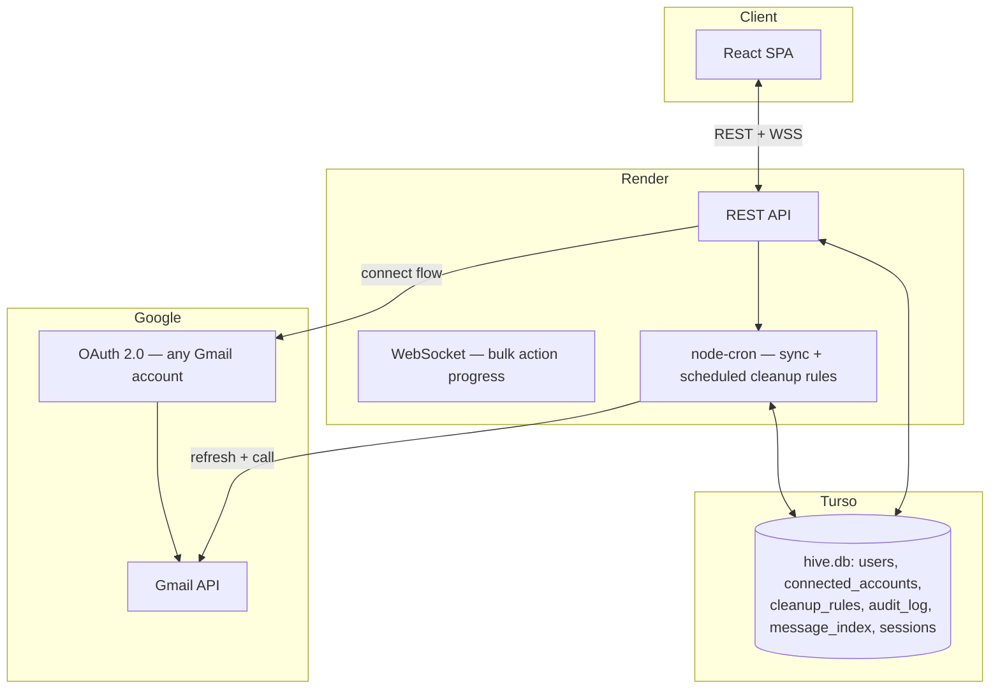
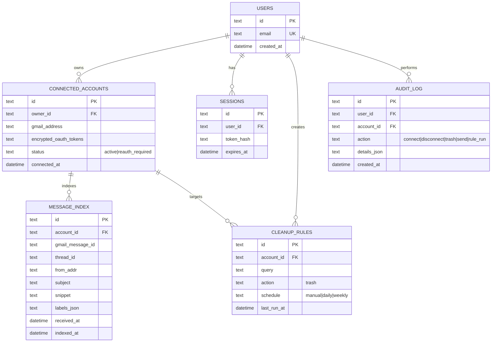
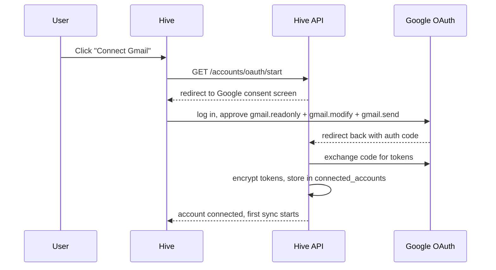

# Hive — Master Build Plan (v2: open source, hosted public product)
### Multi-account Gmail manager · MIT-licensed on GitHub · hosted at hive.harshitsaini.in

**What changed from v1:** no company-domain delegation anymore — every account
(anyone's, anywhere) connects the same way, via standard Google OAuth. And this
is now a genuinely public product: anyone in the world can sign up on
hive.harshitsaini.in and manage their own multiple Gmail accounts, while the
full source stays open on GitHub under MIT.

---

## 0. The Google policy reality this plan is built around

Letting **unlimited public strangers** connect their Gmail through your one
hosted app is a materially different ask than "a few people I know" — Google
gates this on purpose, since your app is asking for access to people's email.
Here's exactly what that means for you, and how the plan avoids the expensive
version of it.

**Two separate gates, and they're not both mandatory:**

| Gate | What triggers it | Cost/effort |
|---|---|---|
| **OAuth verification** | Any app requesting `gmail.readonly`, `gmail.modify`, or `gmail.send` and wanting more than ~100 total users | Free. Needs: a public privacy policy + terms of service, your domain verified in Google Search Console, OAuth consent screen fully branded (name, logo, support email), a short demo video showing exactly how each requested scope is used, then Google review — typically a few weeks elapsed. |
| **CASA security assessment** (extra, on top of verification) | Only triggered if you request a **restricted** scope — specifically the full-mailbox scope `https://mail.google.com/`, which is what true permanent-delete requires | Sensitive-tier scopes (`gmail.readonly`, `gmail.modify`, `gmail.send`) generally skip this entirely. If you do end up needing the restricted scope later, current Google guidance lets many apps complete Tier 2 CASA via a self-assessment questionnaire (no paid third-party auditor needed for most apps at this tier) — but it's still an extra step worth avoiding for v1. |

> ⚠️ **Superseded.** The trash-only decision below was reversed during Phase 2.
> Hive now requests `https://mail.google.com/` and does offer permanent
> deletion. See `docs/decisions/0002-permanent-delete.md` for the reasoning and
> the cost that comes with it. Everything else in this section still holds —
> including that the restricted scope is free in Testing mode and only becomes
> a CASA question at public launch.

**Design decision that keeps you out of the expensive lane:** the hosted
product offers **trash, not permanent delete**. Gmail's own Trash already
auto-empties after 30 days, so "delete" from a user's point of view still
happens — you're just not requesting the broadest, riskiest scope to do it.
This keeps Hive's hosted app on `gmail.readonly` + `gmail.modify` + `gmail.send`
— the standard verification path, no CASA. (Because it's open source, anyone
who *really* wants instant permanent-delete can self-host with their own
Google Cloud project and add that scope themselves — see §9. That's a genuine
bonus of open-sourcing it, even though it's not your main distribution model.)

**Practical sequencing tip:** submit for verification early — while it's under
review, your app can still run in Testing mode for up to 100 real users. So
you don't sit idle waiting; you keep building and testing with real early
users right up to the cap while Google's review runs in parallel.

**One more real (small) cost to plan for honestly:** a privacy policy and
terms of service that *accurately* describe what Hive does. You don't need to
pay a lawyer for this — free generators (e.g. a template privacy-policy tool)
are fine for a free, non-commercial tool as long as the content is true. Hive
is compliance-friendly by design here: it never stores full email bodies
(§2), never shares data with third parties, and has no ads — so the honest
answer to "what do you do with my data" is short and clean.

---

## 1. Infrastructure stack (unchanged, ₹0)

Same as before — Vercel (frontend), Render (backend: REST + WS + cron),
Turso (metadata DB), Resend (OTP email), Cloudflare (DNS), GitHub (public
repo + free Actions minutes). No new service needed for this pivot.

---

## 2. Architecture (simplified — one connection path)



Every account — personal or someone's Workspace account — connects the exact
same way: click "Connect Gmail," Google consent screen, done. One code path,
not two. This is materially simpler to build and test than v1.

As before: **Hive never mirrors full email bodies.** `message_index` stores
only subject/sender/date/labels/snippet/message-ID for fast search; actual
content is fetched from the Gmail API on demand when a user opens a message.

---

## 3. Data model (simplified)



Each user directly owns their `connected_accounts` — no cross-user sharing
layer for v1. (A "share this account with a teammate" feature is a clean,
optional addition later — see roadmap — but it's not needed for the core
"I manage my own several Gmail accounts" product you're actually building.)

Note what's gone from v1: `workspace_domains`, `account_access`,
`connection_type` — all only existed to support company-domain delegation,
which no longer exists in this design.

---

## 4. Connecting an account (single flow now)



**Before verification is complete:** Testing mode, so unverified personal
accounts hit the same 7-day refresh-token expiry noted in v1 — expected and
fine for your first ~100 real users while verification is in review. Surface
`status: reauth_required` clearly in the UI, same as before.

**After verification:** this limitation goes away — tokens behave normally,
no cap, no unverified-app warning screen. This is the actual finish line for
"real public launch," not just a nice-to-have.

---

## 5. Core features (unchanged in spirit, scope-adjusted)

- **Unified inbox + search** across all of a user's connected accounts, using
  Gmail's own search syntax (`from:`, `has:attachment`, `older_than:`,
  `label:`).
- **Bulk trash** via `users.messages.batchModify` (up to 1000 IDs/call),
  reversible, sits in Gmail Trash 30 days — this is the only bulk-delete
  action the hosted product offers, by design (§0). Live progress over
  WebSocket for large batches.
- **Cleanup rules** — saved queries that auto-trash matches on a schedule
  (e.g. "promotions older than 30 days, weekly"). This is the feature that
  directly automates your original pain point, and it's genuinely useful to
  anyone with cluttered inboxes — a good headline feature for an open-source
  launch.
- **Compose & send** from any connected account, `users.messages.send`.
  Worth surfacing in the UI: consumer Gmail caps around 500 sends/day,
  Workspace around 2,000/day — good to show a quota indicator rather than
  let a bulk-send silently fail against Google's own limit.
- **Sync engine** via `users.history.list` with a stored `historyId` per
  account for incremental updates. One detail worth building in from day
  one: Gmail's history only reaches back about 30 days — if an account
  hasn't synced in longer than that (e.g. was `reauth_required` for a while),
  fall back to a full re-index rather than trusting a stale `historyId`.

---

## 6. What "open source" needs beyond just the code

- **`LICENSE`** — MIT (root of repo). Simple, permissive, standard choice for
  a portfolio/community project.
- **`CONTRIBUTING.md`** — how to run it locally, coding conventions, how to
  open a PR. Worth writing well; it's often the first thing a prospective
  contributor (or interviewer glancing at your repo) actually reads.
- **`docs/SELF-HOSTING.md`** — step-by-step: create your own Google Cloud
  project, enable the Gmail API, configure your own OAuth consent screen and
  test users, set your env vars, deploy. This is what makes "open source for
  everyone" actually true even before your own hosted instance is verified,
  or for anyone who wants to run their own with different scopes.
- **`.env.example`** — every required variable, clearly commented.
- **Public `/privacy` and `/terms` pages** in the actual web app — required
  both for Google's verification review and for basic legitimacy as a public
  product handling people's email.
- Optional, nice-to-have for a public repo: a couple of GitHub issue
  templates (bug report / feature request) so contributions come in
  structured.

---

## 7. Design

Claymorphism — soft, rounded, tactile surfaces with depth from layered shadow
rather than borders. Hive owns its own token set rather than sharing one with
any other project; see `design-system/MASTER.md` and `apps/web/src/tokens.css`.

---

## 8. `CLAUDE.md` — updated

```markdown
# CLAUDE.md — Hive

## What this project is
Hive is an open-source, hosted multi-account Gmail manager: connect any number
of Gmail accounts via OAuth, search and bulk-clean across all of them, and
compose/send from any connected identity. MIT licensed, public repo, hosted at
hive.harshitsaini.in. Full design in docs/02-architecture.md. Read
docs/01-project-state.md first, every session.

## Non-negotiable rules

### Git & attribution
- NEVER add a Co-Authored-By trailer or "Generated with Claude Code" text to
  commits or PRs. .claude/settings.json already sets attribution.commit/pr to
  empty strings — do not remove that.
- Commit messages: imperative, human voice, conventional commits. No
  AI/Claude/Anthropic mentions anywhere in code, comments, README, or docs.
- Use `gh` for repo/PR/issue operations.

### Scope discipline (this is the load-bearing rule for this project)
- The hosted product requests ONLY gmail.readonly, gmail.modify, gmail.send.
  NEVER add https://mail.google.com/ (full mailbox scope) to the hosted app's
  OAuth request without an explicit ADR explaining why and confirming CASA
  implications — this scope change affects Google verification status.
- "Delete" in the hosted product means trash (batchModify), never
  batchDelete. If a self-hosting user wants true permanent delete on their
  own instance, that's documented in docs/SELF-HOSTING.md as something they
  opt into themselves, not a hosted-product default.

### Documentation discipline
- Update docs/01-project-state.md every session; append a dated entry to
  docs/daily-log/YYYY-MM-DD.md.
- Any scope, licensing, or verification-related decision gets an ADR in
  docs/decisions/ — these are exactly the decisions a future contributor (or
  future you) will need the reasoning for.
- docs/SELF-HOSTING.md and .env.example must stay accurate as the project
  evolves — they're load-bearing for the "open source for everyone" promise,
  not optional extras.

### Testing
- Playwright, headed mode locally, headless in CI.
- Any route touching trash or send needs a test asserting the audit_log row
  was written.

### Privacy & legitimacy
- /privacy and /terms pages must stay accurate to what the code actually
  does — never let them drift from reality as features change.
- Never persist full email body/attachment content to Turso — message_index
  is metadata only.
- Encrypt all tokens at rest; never log them.

### Cost discipline
- No new paid tier or card-requiring service without flagging it first and
  proposing a free alternative.
```

---

## 9. Repo structure

```
hive/
├── apps/{web,server}/
├── packages/{gmail-client, db, shared-types}/
├── docs/
│   ├── 01-project-state.md
│   ├── 02-architecture.md
│   ├── 03-api-reference.md
│   ├── 04-deployment.md
│   ├── SELF-HOSTING.md
│   ├── decisions/
│   └── daily-log/
├── .claude/settings.json
├── CLAUDE.md
├── LICENSE
├── CONTRIBUTING.md
├── .env.example
└── .github/workflows/{ci.yml, e2e.yml}
```

---

## 10. Roadmap

| Phase | Deliverable | Definition of done |
|---|---|---|
| **0 — Foundation** | Scaffold, CLAUDE.md, LICENSE, infra accounts | `npm run dev` boots; CI green |
| **1 — Auth + OAuth connection** | OTP login, single Gmail OAuth connect flow, reauth_required detection | Can connect a real Gmail account end-to-end in Testing mode |
| **2 — Unified inbox + search** | Merged view, Gmail-syntax search, history.list sync | Search across 2+ connected accounts works correctly |
| **3 — Bulk trash + WS progress** | Multi-select, batchModify, live progress bar | Trashing 500+ test emails shows accurate progress + audit_log rows |
| **4 — Compose/send** | From-account picker, send, quota indicator | Can send from any connected identity, quota shown |
| **5 — Cleanup rules** | Rule builder, manual run, then scheduled | A saved rule correctly trashes only matching messages |
| **6 — Open-source readiness** | LICENSE, CONTRIBUTING.md, SELF-HOSTING.md, .env.example, issue templates | A stranger could clone the repo and run their own instance from docs alone |
| **7 — Verification prep & submission** | Privacy/terms pages, domain verification, consent screen branding, demo video, submit | Verification request submitted to Google; app keeps running in Testing mode meanwhile |
| **8 — Design pass** | Claymorphism UI, theming | Coherent token-driven visual language, responsive |
| **9 — Hardening + public launch** | Rate limiting, full Playwright suite in CI, hive.harshitsaini.in live, verification (hopefully) approved | Docs complete, green CI, live domain, ideally past the 100-user cap |

**Timeline:** hands-on build time is actually shorter than v1 (~7–8 weeks at
the same ~20 hrs/week pace) since there's only one connection path to build
and test. Budget extra *elapsed* (not hands-on) time in Phase 7 for Google's
review — start that submission as early as Phase 6 finishes so it's running
in the background while you do Phases 8–9.

---

## 11. Day-1 checklist

```bash
gh repo create hive --public --clone
cd hive
npm init -w apps/web -w apps/server -w packages/gmail-client -w packages/db -w packages/shared-types -y
mkdir -p docs/decisions docs/daily-log .claude
touch LICENSE CONTRIBUTING.md docs/SELF-HOSTING.md .env.example
# paste MIT LICENSE text, CLAUDE.md, .claude/settings.json content
git add .
git commit -m "chore: scaffold monorepo"
```

Before writing any Gmail-facing code: create the Google Cloud project, enable
the Gmail API, configure the OAuth consent screen (External, Testing, add
yourself as a test user) — get one real account connecting end-to-end before
building anything else on top.
